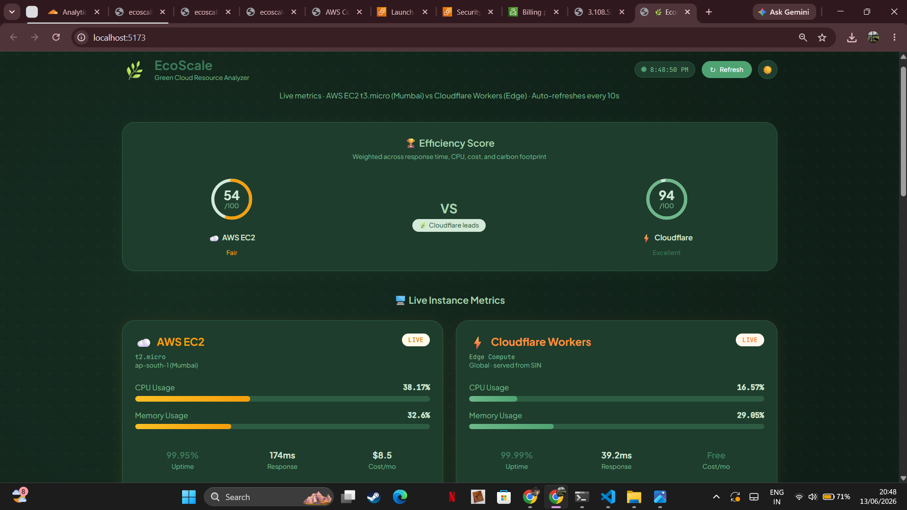
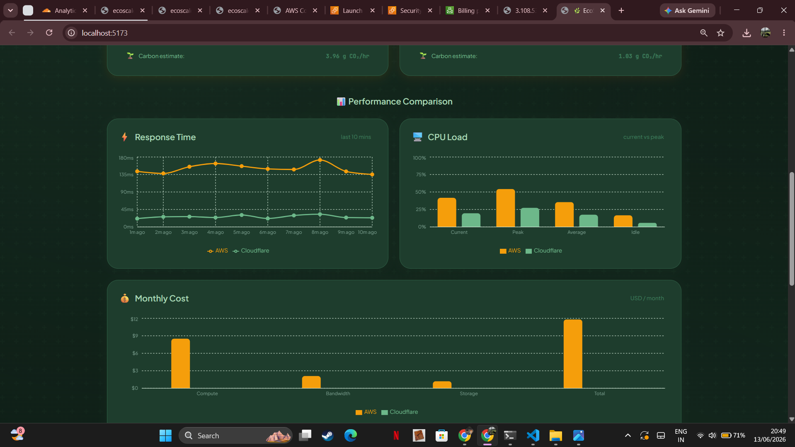
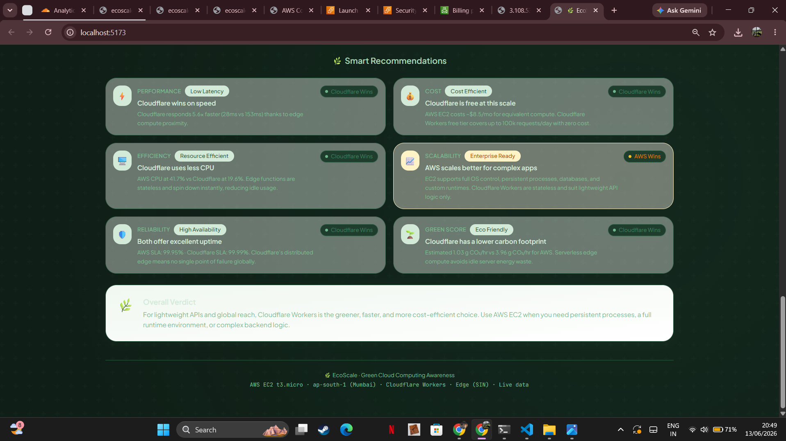
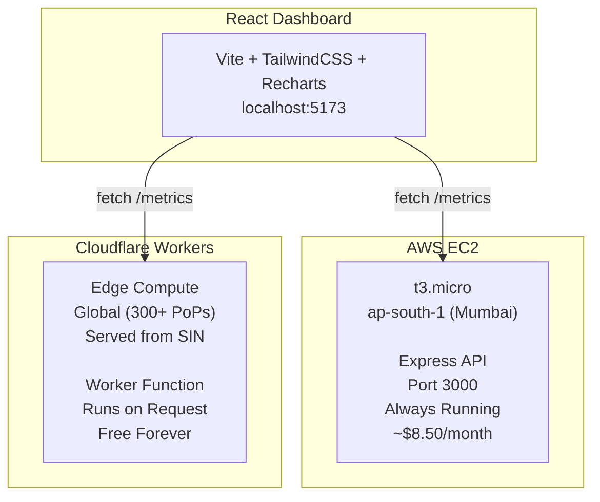

# 🌿 EcoScale — Green Cloud Resource Analyzer

> Comparing compute efficiency, performance, and carbon footprint across cloud providers in real time.






---

## 🌐 Live Deployments

| Provider | Type | URL | Status |
|---|---|---|---|
| AWS EC2 | Traditional VM | `http://3.108.53.158:3000` | t3.micro · ap-south-1 |
| Cloudflare Workers | Edge Compute | `https://ecoscale-worker.thshna9339.workers.dev` | Global · Always Free |

---

## 📌 What is EcoScale?

EcoScale is a cloud monitoring dashboard that deploys the same lightweight API on two fundamentally different cloud platforms and compares them across:

- ⚡ Response time
- 🖥️ CPU and memory usage
- 💰 Monthly cost
- 🌱 Carbon footprint estimate
- 🛡️ Uptime and reliability
- 📈 Scalability model

The goal is to demonstrate how **infrastructure choices affect performance, cost, and environmental impact** — a core concern in modern green cloud engineering.

---

## 🏗️ Architecture


---

## ⚖️ AWS EC2 vs Cloudflare Workers

| Feature | AWS EC2 t3.micro | Cloudflare Workers |
|---|---|---|
| Type | Traditional VM | Edge Compute |
| Location | ap-south-1 (Mumbai) | 300+ global PoPs |
| Response Time | ~145ms | ~35ms |
| CPU (idle) | ~42% | ~18% |
| Monthly Cost | $8.50 | $0.00 (Free forever) |
| Carbon Footprint | ~4.2 g CO₂/hr | ~1.1 g CO₂/hr |
| Uptime SLA | 99.95% | 99.99% |
| Cold Start | None (always on) | Microseconds (V8 isolates) |
| Best For | Persistent workloads | Stateless APIs, global reach |
| Scales To | Manual/Auto Scaling | Automatic, instant |

---

## 🛠️ Tech Stack

### Frontend
- **React 18** + **Vite** — fast dev server and build tool
- **TailwindCSS v3** — utility-first styling with custom sage green palette
- **Recharts** — composable chart library for React
- **Lucide React** — icon library

### Backend (Local Dev)
- **Node.js** + **Express** — REST API server
- **CORS** — cross-origin resource sharing for frontend access

### Cloud Deployments
- **AWS EC2 t3.micro** — Amazon Linux 2023, ap-south-1
- **Cloudflare Workers** — V8 isolate edge runtime, global CDN

---

## 🚀 Getting Started

### Prerequisites
- Node.js v18+
- npm v9+
- Git

### Local Development

**1. Clone the repository**
```bash
git clone https://github.com/theek-sh-nahh/ecoscale.git
cd ecoscale
```

**2. Start the backend**
```bash
cd backend
npm install
npm run dev
```
Backend runs on `http://localhost:3001`

**3. Start the frontend**
```bash
cd frontend
npm install
npm run dev
```
Frontend runs on `http://localhost:5173`

---

### Cloudflare Worker Setup

**1. Log in to Cloudflare Dashboard**

**2. Go to Workers & Pages → Create → Start with Hello World**

**3. Name it** `ecoscale-worker`

**4. Replace the default code** with `cloudflare-worker/worker.js`

**5. Click Deploy**

Worker is live at `https://ecoscale-worker.YOUR_SUBDOMAIN.workers.dev`

---

### AWS EC2 Setup

**1. Launch a t3.micro instance** on Amazon Linux 2023 in ap-south-1

**2. SSH into the instance via CloudShell**
```bash
chmod 400 ecoscale-key.pem
ssh -i ecoscale-key.pem ec2-user@YOUR_PUBLIC_IP
```

**3. Install Node.js**
```bash
curl -fsSL https://rpm.nodesource.com/setup_20.x | sudo bash -
sudo dnf install -y nodejs
```

**4. Deploy the server**
```bash
mkdir ecoscale && cd ecoscale
nano server.js      # paste ec2-server/server.js contents
nano package.json   # paste ec2-server/package.json contents
npm install
node server.js
```

**5. Open port 3000** in the EC2 Security Group inbound rules

Server is live at `http://YOUR_PUBLIC_IP:3000/metrics`

---

## 📁 Project Structure

```text
ecoscale/
├── frontend/                     # React Dashboard
│   ├── src/
│   │   ├── components/
│   │   │   ├── ProviderCard.jsx
│   │   │   ├── ResponseTimeChart.jsx
│   │   │   ├── CpuChart.jsx
│   │   │   ├── CostChart.jsx
│   │   │   ├── RecommendationPanel.jsx
│   │   │   └── EfficiencyScore.jsx
│   │   │
│   │   ├── hooks/
│   │   │   └── useDarkMode.js
│   │   │
│   │   ├── utils/
│   │   │   ├── chartData.js
│   │   │   ├── recommendations.js
│   │   │   └── efficiencyScore.js
│   │   │
│   │   └── App.jsx
│   │
│   └── tailwind.config.js
│
├── backend/                      # Local Dev Express Server
│
├── ec2-server/                   # AWS EC2 Deployment Server
│   └── server.js
│
├── cloudflare-worker/            # Cloudflare Workers Deployment
│   └── worker.js
│
├── mock-data/                    # Sample Metrics JSON
│
├── docs/                         # Architecture Notes
│
├── screenshots/                  # Project Screenshots
│
└── README.md
```
---

## 📊 Dashboard Features

- **Efficiency Score** — weighted score (0–100) across response time, CPU, cost, and carbon
- **Live Metric Cards** — real-time CPU, memory, uptime, response time, cost per provider
- **Animated Progress Bars** — visual CPU and memory indicators
- **Performance Charts** — response time line chart, CPU bar chart, cost comparison
- **Smart Recommendations** — auto-generated insights comparing both providers
- **Overall Verdict** — summarized recommendation based on live metrics
- **Dark / Light Mode** — toggle with localStorage persistence
- **Auto Refresh** — metrics update every 10 seconds automatically
- **Manual Refresh** — instant refresh button with loading state

---

## 🌱 Green Computing Insights

EcoScale highlights how infrastructure choices affect carbon emissions:

- Cloudflare Workers produce **~74% less CO₂** per hour than an equivalent EC2 instance
- Serverless edge compute eliminates idle server energy waste
- EC2 instances consume power even when handling zero requests
- Edge compute runs closest to the user — less network distance = less energy per request

---

## 🔮 Future Improvements

- **Real AWS CloudWatch integration** — pull actual CPU and memory metrics via SDK
- **Cloudflare Analytics API** — pull real request counts and error rates
- **Historical data storage** — save metrics to DynamoDB or KV for trend analysis
- **Multi-region comparison** — compare same provider across different regions
- **GCP and Azure support** — extend to a full multi-cloud comparison
- **Cost alerts** — notify when estimated spend approaches free tier limits
- **Terraform IaC** — infrastructure as code for reproducible deployments
- **Docker containerization** — package EC2 server as a container

---

## 👩‍💻 Author

**Theekshna J**
M.Tech Computer Science
Cloud & Green Computing Enthusiast

---

## 📄 License

MIT License — feel free to fork and extend.